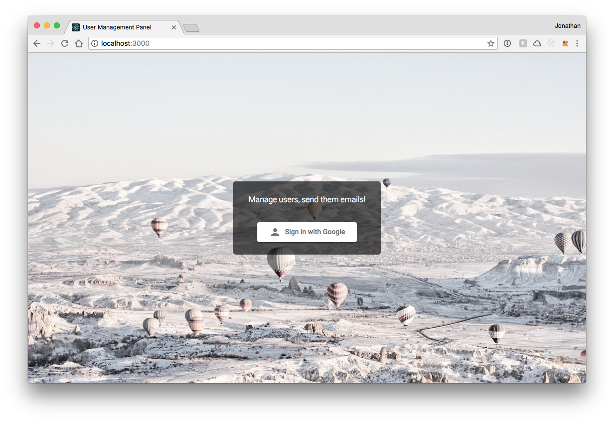

# Two Story Robot Code Challenge Submission

This is Two Story Robot's Code Code Challenge submission for the "Data Driven 
Mine Development - Team Expansion" RFP.

It is a simple user management application with various iteractive features.
The backend of the application is written in Javascript in Nodejs using the Koa 
framework with a Postgres database. The frontend is written in React with 
Material UI components. All testing is written in Jest. Component development 
is done with Storybook.

# Evaluation the UI 

**Required tools**:

* Docker
* Chrome

Both the frontend and the backend are built as docker images for easier 
evaluation. You can start the entire stack by running

    ./start.sh

This may take a few minutes as it needs to pull down all the packages and build 
the applications. Once things have started visit `http://localhost:3000` in a 
Chrome browser.

## Testing Features

The following are stories and test procedures for all features required in this 
code challenge.

### User Story #1 – Register with the application

As a user, I want to be able to register with the application.

**Given** that I am a User 
**And** that I have not already registered 
**When** I properly authenticate using the appropriate credentials 
**Then** my profile is created and visible in the Registered Users List 

When you visit the main page of the application at `http://localhost:3000` you 
will be presented with a 'Signin with Google' button. Click this button and you 
will be prompted to signin or specify a google account. Once you've selected an 
account you will be authenticated, a new user account with your details from 
Google will be created for you, and you will be presented with the Registered 
Users screen.

**Note** the first user that authenticates will automatically be given admin 
permissions. Any subsequent user will not have admin permissions

# Architecture

This is a single repo containing two node packages for both frontend and 
backend. Each directory will maintain it's own `package.json` and scripts for 
better isolation. You will need to change into each directory to run the 
appropriate npm scripts.

## Frontend

The frontend of the application is a react app in [`/frontend`](./frontend).  

### Scripts

    npm start

Start the react dev server. For development purposes.

    npm run storybook

Builds and runs storybook explorer for component driven development. All 
components will be viewable and interactable within storybook.

## Backend

The backend of the application is a koa server in [`/backend`](./backend).
 

# Code Challenge Notice, Instructions & Rules
Re: Competition "Data Driven Mine Development - Team Expansion" (the “RFP”)

Government Contact: andrew.l.sutherland@gov.bc.ca 

This notice is dated September 10, 2018 (the “Notice Date”).

Congratulations - you are a Shortlisted Proponent eligible to participate in 
the Code Challenge (Step 4 of the evaluation process described on the 
Evaluation tab of the RFP).

## Rules and Instructions
Please be advised of the following rules and instructions:
1. These code challenge rules and instructions apply only to Shortlisted 
Proponents and are part of the RFP.
2. Shortlisted Proponents will have no less than two (2) Business Days from the 
Notice Date to complete the code challenge. The deadline to complete the code 
challenge in accordance with these rules is 4:00 p.m. Pacific Time on Thursday, 
September 13, 2018 (the “Deadline”).
3. The Shortlisted Proponent’s code challenge submission Deliverable (defined 
below) must be received by the Province (as provided for by these instructions) 
and be deposited and located in the applicable Repository before the Deadline, 
failing which such submission will not be eligible for evaluation and the 
associated Shortlisted Proponent Proposal will receive no further consideration 
and such Shortlisted Proponent will be eliminated from the RFP competition.
4. Only the Proponent Resources that were put forward in a Shortlisted 
Proponent’s RFP Proposal are eligible to participate in the Code Challenge.
5. The Shortlisted Proponent Resources will be sent invites via GitHub to join 
this private repository ([INSERT PRIVATE REPO]). Please forward to the 
Government Contact the GitHub handles of those Proponent Resources who will be 
taking part in the Code Challenge.
6. As of the Notice Date, the code challenge issue has been created in this 
private repository ([INSERT PRIVATE REPO]), under the 
"BCDevExchange-CodeChallenge" organization.
7. Shortlisted Proponents may direct clarifying questions to the Government
Contact. Any such questions must be received by the Government Contact
before 4:00 p.m. Pacific time on Wednesday, September 12, 2018 (the “Code 
Challenge Questions Deadline”).
8. The Province reserves the right to amend this notice before or after the 
Closing Time, including changing the Deadline or the Code Challenge Questions
Deadline upon notice to all Shortlisted Proponents.
9. The Shortlisted Proponent must complete all of the following tasks and
Deliverable and as such they must be deposited and received in the applicable
Repository by the Province in the form specified by this notice before the
Deadline:
* Complete all code changes required to complete the code challenge (the 
* "Deliverable"); and
* Attach an Apache License 2.0 to the Deliverable.
10. The rules and instructions set forth in this notice are in addition to any 
rules, terms and conditions set forth elsewhere in the RFP.

# Code Challenge (Mines)

## Description

Included are scripts for building and running one Docker container: 
* A Postgres database loaded with the sample schema and data

The scripts handle retrieval of the appropriate images, loading of the sample 
data, and setting of default user credentials.

## Requirements

* Docker

## Getting Started

* Run the included `start.sh` script to launch the containers.
* The Postgres container exposes port 5432 and can be connected to with either 
    the admin account (postgres/postgresadmin) or the read-only user account 
    (pguser/pguser)
* Feel free to change the default admin and user account credentials
* You can verify the containers are running using the command 
    `docker container ls | grep code-challenge` or by connecting to each one 
    using your favourite client tool (e.g. Postico)

## Code Challenge Instructions

### Introduction

This code challenge asks you to build an application that allows the 
application’s users and administrators to:

1.	create and store user profile information in a Postgres database; and
2.	perform various operations on the database

User profile information will be obtained from one of the following:

1.	Google Sign-In for websites 
(https://developers.google.com/identity/sign-in/web/sign-in);
2.	Facebook Login for the web 
(https://developers.facebook.com/docs/facebook-login/web); or
3.	A different authentication provider (OAuth) of your choice

Basic profile information, including user id, first name, last name, profile 
image, and email will be retrieved from a successful authentication and stored.  
You can choose to store additional information in the profile if you choose, 
but this is not required.  You should also record a timestamp of when the user 
registered by signing in the first time.

### Required Database Operations

Users must be able to perform the following operations (collectively, the “User 
Operations”):

1.	Register with the application by authenticating with the chosen provider;
2.	Update their own application profile by manually editing one of the fields; 
3.	Delete their own profile; 
4.	Sign in to the application using their provider credentials;
5.	Sign out of the application;
6.	View a list of all registered users of the application (the “Registered 
Users List”).
7.	Perform a simple filter of the Registered Users List; and
8.	Perform a simple sort of the Registered Users List

Note that each user can have one and only one profile attached to that user’s 
credentials.

Administrators must be able to perform the following operations (collectively,
the “Admin Operations”):

1.	Update any user profile;
2.	Delete any user profile;
3.	Access the application using admin authentication;
4.	Send boilerplate emails to users; and
5.	Any of the regular User Operations listed above in #5 to #8

The typical user will be familiar with web applications, but unfamiliar with 
this particular application.

The typical administrator will be conversant with typical database UIs and 
administrative tools.

### Database UI Suggestions

The application must allow users and administrators to perform the User 
Operations and Admin Operations, respectively.

 We recommend that you design a UI that resembles the following drawing:

 

### Technical Requirements

Participating teams are not limited to a certain stack or any specific 
technologies.  We do encourage everyone to use a stack that is commonly used in 
developing modern web applications.  For instance, a good choice of framework 
would be Angular, React or Vue.

### User Stories

All of the following user stories must be completed.  They may be completed in 
any order.

#### User Story #1 – Register with the application

As a user, I want to be able to register with the application.

**Given** that I am a User 
**And** that I have not already registered 
**When** I properly authenticate using the appropriate credentials 
**Then** my profile is created and visible in the Registered Users List 

#### User Story #2 – Delete my own profile

As a user, I want to be able to delete my profile from the application.

**Given** that I am a User 
**And** that I have signed in to the application 
**When** I activate the “Delete” UI control related to my user profile 
**Then** my profile is deleted from the Registered Users List 

#### User Story #3 – Delete a user profile (Admin)

As an administrator, I want to be able to delete any given user profile from 
the application.

**Given** that I am an Administrator 
**And** that I have signed in to the application as an Administrator 
**When** I activate the “Delete” UI control related to a user profile 
**Then** that user profile is deleted from the Registered Users List 

#### User Story #4 – Edit my own user profile 

As a user, I want to be able to edit my own user profile.

**Given** that I am a User 
**And** that I have signed in to the application 
**When** I activate the “Edit” UI control related to my profile 
**Then** I am shown a modal interface that allows me to edit my info 
**And** I am allowed to save my modified profile 
 
#### User Story #5 – Edit a user profile (Admin)

As an administrator, I want to be able to edit any user profile.

**Given** that I am an Administrator 
**And** that I have signed in to the application as an Administrator 
**When** I activate the “Edit” UI control related to an arbitrary user 
profile 
**Then** I am shown a modal interface that allows me to edit the select user 
info 
**And** I am allowed to save the modified profile 

#### User Story #6 – Sign-in

As a user I want to sign in to the application using my username and password 
AND As an application manager, I want all users to be authenticated before they 
access the application.  

**Given** that a User is attempting to access the application 
**When** the User properly authenticates using the appropriate credentials 
**Then** the User is granted user-level access to the application. 

#### User Story #7 – Sign-out

As a user or as an administrator, I want to be able to sign out of the 
application.

**Given** that I am signed in as a user or as an administrator 
**And** I want to sign out of the application 
**When** I active the Sign-out or Logout UI element 
**Then** I am logged out of the application  
**And** I cannot access associated UI elements until I sign back in 

#### User Story #8 – Send Email to User (Admin)

As an administrator, I want to able to send a boilerplate email to a user.

**Given** that I am signed in as an administrator 
**And** I want to send a boilerplate email to an individual user 
**When** I active the “Mail” UI control related to an individual user 
**Then** a boilerplate email is sent to the email address associated with that 
user 

**Implementation Notes:** 
The boilerplate email template will be provided in a separate file called 
“email-message.txt”. 
A successful implementation merely needs to email the provide template to a 
given user.

#### User Story #9 – Simple Filter

As a user, I want to be able to filter columns with text content using a 
“startsWith” filter.

**Given** that I am signed in to the application as a user or an 
administrator 
**And** I have selected a field in the Registered Users List 
**When** I enter a filter term 
**Then** all database entries that satisfy the filter term for the selected 
field are displayed 
**And** no other database entries are displayed 

**Implementation Notes:** 
The filter shall be a “startsWith” filter only. 
The filter shall apply only to fields with text content. 
The filter shall not apply hierarchically.  That is, the filter shall filter 
the database for a single column only.  For instance, an operation that first 
filters Column A for term B and then filters Column C for term D does not need 
to be supported (and no additional points will be given for such an 
implementation).
 
#### User Story #10 – Simple Sort

As a user, I want to be able to sort columns of type “String” in ascending and 
descending order.

Use Case #1 (Ascending Order)

**Given** that I am signed-in to the application as a user or as an 
administrator 
**And** I have selected a field in the Registered Users List 
**When** I click on the UI control that allows the field to be sorted in 
ascending order 
**Then** the users in the list are displayed in ascending order 

Use Case #2 (Descending Order)

**Given** that I am signed-in to the application as a user or as an 
administrator 
**And** I have selected a field in the Registered Users List 
**And** I have previously sorted that field in ascending order 
**When** I click on the “Sort” UI control  
**Then** the users in the list are displayed in descending order 

**Implementation Notes:** 
The sort operation shall apply only to fields with text content. 
The sort operation shall not apply hierarchically.  That is, the sort operation 
shall sort the database for a single column only.  For instance, a sort 
operation that first sorts Column A in ascending order and then sorts Column C 
in ascending order does not need to be supported (and no additional points will 
be given for such an implementation).

### REST API Requirements

The update operations must be implemented by making a server-side REST API call
to an endpoint with the signature “**/update**”.

The delete operations must be implemented by making a server-side REST API call 
to an endpoint with the signature “**/delete**”.

The authenticate/create operation must be implemented by making a server-side 
REST API call to an endpoint with the signature “**/authenticate**”.

The sendEmail operation must be implemented by making a server-side REST API 
call to an endpoint with the signature “**/sendEmail**”.
 
### Submission Requirements

1.	Submit all code by way of a pull request to this repository.  Your team’s 
final pull request must be submitted before 4 p.m. Pacific Time on Thursday, 
September 13, 2018.
2.	Attach an Apache License 2.0 to your pull request.
3.	Update the repo’s README file to include any instructions required for the 
code challenge evaluators to build and run your team’s application.
